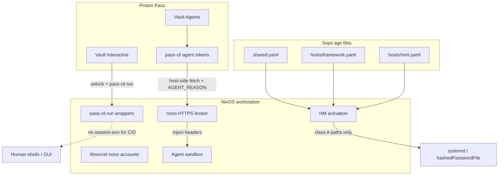

# Plan: per-host sops + Proton Pass (human + agent)

**Status:** proposed  
**Decisions locked:** per-host files **plus** a shared all-hosts file; Proton Pass for interactive approval **and** Pass CLI agent mode (`agent create` / `access grant` / `monitor`).

Related: [sops-age-keys.md](./sops-age-keys.md), [SCHEMA.md](../../secrets/SCHEMA.md), [ADR 0001](../adr/0001-nono-as-single-sandboxing-system.md), existing [sync-media-secrets-to-pass.bash](../../scripts/shell/sync-media-secrets-to-pass.bash).

---

## Goals

1. **Cryptographic isolation** — a stolen `framework` age key must not decrypt `mini` media/Matrix secrets (or other hosts’ password hashes).
2. **Keep a shared file** — secrets every host needs at activation stay in one place.
3. **User approval for interactive secrets** — human CLIs get secrets only after Proton Pass unlock / `pass-cli run`.
4. **Audited agent access** — coding agents use Proton Pass **agent** tokens with vault/item grants and `PROTON_PASS_AGENT_REASON`, while keeping ADR 0001’s rule: **sandbox never sees raw API keys** (broker still injects).
5. **Easy rotation** — one recipe path to rotate tokens/passwords, update the right sops file, and upsert the matching Proton Pass item(s).
6. **Pass inventory** — every Pass item that mirrors (or is sourced from) a sops secret is declared in a committed registry so nothing is “created once and forgotten.”

Non-goals for this plan: moving mini daemon secrets into Pass as sole source of truth (headless; no interactive unlock); replacing Darwin 1Password in the same change (keep parallel; Linux = Pass).

---

## Target layout

### Sops files (age recipients)

```text
secrets/
  shared.yaml              # &editor + all host anchors
  hosts/
    mini.yaml              # &editor + &mini
    framework.yaml         # &editor + &framework
    desktop.yaml           # &editor + &desktop
    caya.yaml              # &editor + &caya
  SCHEMA.md                # updated for multi-file
  pass-inventory.yaml      # committed, NON-SECRET registry of Pass↔sops links
```

`.sops.yaml` gets one `creation_rules` entry per path (not one shared rule for everything):

| `path_regex` | Recipients |
|---|---|
| `secrets/shared\.yaml` | editor + framework + desktop + caya + mini |
| `secrets/hosts/mini\.yaml` | editor + mini |
| `secrets/hosts/framework\.yaml` | editor + framework |
| `secrets/hosts/desktop\.yaml` | editor + desktop |
| `secrets/hosts/caya\.yaml` | editor + caya |

Yes: **shared + per-host is the intended model.** Sops can only vary recipients per *file*, so this is how per-path isolation works.

### What goes where (classification)

| Class | Store | Examples | Decrypt / unlock |
|---|---|---|---|
| **A — machine** | host sops file | `users/jadee/password_*`, mini media/Matrix/Caddy/hermes templates, deploy keys, WireGuard | host age key at `flake switch` |
| **B — shared machine** | `shared.yaml` | `github_token` for `NIX_CONFIG` access-tokens (if kept declarative) | any host age key |
| **C — human interactive** | Proton Pass vault `Interactive` | kagi api/session, personal tooling tokens you type/run by hand | Pass login + session unlock; `pass-cli run` |
| **D — agent-brokered** | Proton Pass vault `Agents` | openrouter, context7, `agent_pat` | Pass **agent** with item/vault grant; host broker fetches with reason |

Media UI passwords stay **class A** in `hosts/mini.yaml` (daemons need them). Keep syncing **copies** into Pass for browser autofill via the existing sync script (convenience mirror, not source of truth).

---

## Architecture



**Critical design choice (Pass agents + nono):**  
Do **not** put `PROTON_PASS_PERSONAL_ACCESS_TOKEN` inside the agent sandbox. The Pass agent token lives on the host (sops host file or libsecret after a one-time `agent create`). A small host helper used by the broker (or a pre-start sync into libsecret) calls:

```bash
PROTON_PASS_AGENT_REASON="nono broker: openrouter for pi-flake" \
  pass-cli item view --vault-name Agents --item-title openrouter_api_key --field password
```

Then injects as today. You still get `pass-cli agent monitor` audit entries; the coding agent never sees the Pass token or the API key. That preserves ADR 0001 while using [agent access grant](https://protonpass.github.io/pass-cli/commands/agent/#agent-access-grant).

Darwin stays on 1Password + `just sync-1password` until a follow-up.

---

## Pass inventory (track every Pass↔sops item)

**Problem:** Pass items get created by hand or by sync scripts; titles drift; rotation forgets a mirror; agents get grants to the wrong item.

**Solution:** a committed, plaintext registry [`secrets/pass-inventory.yaml`](../../secrets/pass-inventory.yaml) (never encrypted — no secret values). It is the only allowed list of Pass items that the flake’s sync/rotate tooling may create or update.

### Schema (illustrative)

```yaml
# secrets/pass-inventory.yaml — no secrets; titles + linkage only
version: 1
vaults:
  Interactive: { purpose: human-cli }
  Agents: { purpose: nono-broker }
  Nixflix: { purpose: media-autofill-mirror }  # existing sync-media target (rename optional)

items:
  - id: openrouter-api-key
    vault: Agents
    title: openrouter_api_key          # stable Pass item title
    kind: login                        # login | custom
    sops:
      file: shared                     # shared | hosts/<hostKey>
      path: openrouter_api_key         # YAML path inside that file
    pass_fields:
      password: value                  # map Pass field ← sops value role
    class: D
    rotate: external                   # external | generate | hash
    rotate_hint: "https://openrouter.ai/keys — create key, paste into rotate"
    note: "Managed by flake secrets tooling; do not rename title"

  - id: github-token-nix
    vault: Interactive                 # or Agents if only brokered
    title: github_token
    kind: login
    sops: { file: shared, path: github_token }
    pass_fields: { password: value }
    class: B
    rotate: external
    rotate_hint: "GitHub → Settings → Tokens (fine-grained, public_repo)"

  - id: agent-pat
    vault: Agents
    title: agent_pat
    kind: login
    sops: { file: shared, path: agent_pat }
    pass_fields: { password: value }
    class: D
    rotate: external
    rotate_hint: "GitHub PAT with repo + workflow"

  - id: nixflix-sonarr
    vault: Nixflix
    title: "Nixflix — Sonarr"
    kind: login
    sops:
      file: hosts/mini
      path: mini/media/sonarr          # parent; fields map below
    pass_fields:
      password: password
      "API key": api-key
    url: https://sonarr.jadee.fyi
    username: sonarr
    class: A
    rotate: generate                   # password locally; api-key may be external/service
    mirrors: true                      # Pass is autofill copy; sops is source of truth

  - id: jellyfin-jadee-password
    vault: Nixflix
    title: "Nixflix — Jellyfin (jadee)"
    kind: login
    sops: { file: hosts/mini, path: mini/media/jellyfin/users/jadee-password }
    pass_fields: { password: value }
    class: A
    rotate: generate
    mirrors: true
```

Rules:

1. **No Pass create/update outside inventory** — `just sync-pass*` / `just rotate-secret` refuse unknown titles; new items require an inventory PR first.
2. **After first create**, tooling writes back `pass_item_id:` (Pass UUID) into the inventory entry so renames/title collisions don’t break updates. IDs are not secret.
3. **Drift check** — `just pass-inventory-check` lists Pass items whose note says “Managed by flake…” but are missing from inventory, and inventory entries with no Pass item.
4. **SCHEMA.md** gains a “Pass mirror” column (inventory `id` or `—`) so humans and agents stay aligned.

Media sync ([sync-media-secrets-to-pass.bash](../../scripts/shell/sync-media-secrets-to-pass.bash)) is refactored to **read the inventory** instead of hardcoding titles — one code path for all mirrors.

---

## Rotation & generation wiring

### Rotate kinds

| `rotate` | Behavior | Examples |
|---|---|---|
| `external` | Prompt/paste new value from provider UI; write sops; upsert Pass | github_token, openrouter, context7, kagi, agent_pat, HF, Cloudflare |
| `generate` | Locally generate password/token; write sops; upsert Pass; print “update service UI if needed” | jellyfin user passwords, sonarr/radarr UI passwords, qbittorrent, matrix registration token (when we own it) |
| `hash` | Prompt plaintext once → `mkpasswd -m sha-512` → write hash to sops only (no Pass mirror of plaintext) | `users/jadee/password_*` |

### Tooling shape

Prefer one Python module under `scripts/src/flake_scripts/` (uv-run), thin Just wrappers:

| Recipe | What it does |
|---|---|
| `just secrets-rotate <inventory-id>` | Load inventory → decrypt target sops file → apply rotate kind → `sops` write → Pass upsert if linked → remind `git commit` + provider steps |
| `just secrets-generate-password <inventory-id>` | Alias for `rotate: generate` entries |
| `just secrets-set <inventory-id>` | Paste-only path for `external` (no generator) |
| `just sync-pass --id <id>\|--vault <name>\|--all` | Sops → Pass upsert for inventory entries (`mirrors: true` or class C/D) |
| `just pass-inventory-check` | Drift report |
| `just pass-inventory-bootstrap` | Create missing Pass items from inventory (titles/notes only), write `pass_item_id` back |

### Rotate flow (external token, e.g. OpenRouter)

```text
just secrets-rotate openrouter-api-key
  → prints rotate_hint URL
  → reads new secret from terminal (no echo) or --from-file
  → sops set on secrets/shared.yaml path openrouter_api_key
  → pass-cli item update --item-id <uuid> --field password=…
  → prints: commit shared.yaml; re-run just sync-pass-agents / flake switch as needed
```

Never prints the new value. Never leaves plaintext tempfile unshredded (use process substitution / fifo / sops stdin).

### Generate flow (service password)

```text
just secrets-generate-password nixflix-sonarr
  → openssl/xkcdpass/pass-cli password generate (pick one; prefer pass-cli password if quality OK)
  → write sops hosts/mini.yaml path …
  → upsert Pass Nixflix item
  → prints: “Sonarr UI may still have old password — update at https://… or let nixflix reconcile on next switch”
```

For Arr/Jellyfin where Nix **declares** the password from sops, switch applies it; inventory `rotate_hint` says so. For passwords only in Pass autofill, note “sops+Pass updated; service config follows on switch.”

### Hash flow (login password)

```text
just secrets-rotate password-framework
  → prompt plaintext
  → mkpasswd -m sha-512
  → write users/jadee/password_framework in hosts/framework.yaml
  → no Pass item (plaintext must not land in Pass)
```

### Implementation notes

- Reuse Pass upsert helpers from media sync (create-or-update by `pass_item_id` then title).
- `sops` writes via `sops set` / decrypt-merge-encrypt in memory — same safety bar as media sync (“Secret values stay out of source files, shell history, and command output”).
- Generators: `openssl rand -base64 32` for API-ish secrets; `xkcdpass -n 4` or `pass-cli password generate` for human-typed UI passwords; document choice in inventory `generate: { method, length }`.
- After rotating class D: remind `just sync-pass-agents` so libsecret/broker sees the new value without waiting for next HM activation design.

---

## Phases

### Phase 0 — Inventory (no encrypt changes)

1. Freeze current `secrets/secrets.yaml` key list against SCHEMA.
2. Tag each key A/B/C/D (table above).
3. Author `secrets/pass-inventory.yaml` for every existing media Pass mirror + planned Interactive/Agents titles (even before items exist — `pass_item_id` empty until bootstrap).
4. `just pass-inventory-check` against live vault (dry) to list orphans.

### Phase 1 — Split sops files (isolation only)

1. Create empty encrypted files with correct recipients (`sops secrets/shared.yaml`, etc.).
2. Move keys with `sops` (decrypt → place → re-encrypt); do not leave plaintext in git.
3. Update [`.sops.yaml`](../../.sops.yaml) creation_rules as above.
4. Teach Nix multi-file defaults:
   - [`lib/default.nix`](../../lib/default.nix): replace single `sopsFile` with `sopsFiles = { shared = …; host = …; }` or `defaultSopsFile` + explicit `sopsFile` on host-only secrets.
   - [`modules/nixos/sops.nix`](../../modules/nixos/sops.nix) / [`modules/profiles/minimal/security.nix`](../../modules/profiles/minimal/security.nix): `defaultSopsFile = shared`; host modules set `sops.secrets.<name>.sopsFile = hosts/${hostKey}.yaml`.
   - [`modules/nixos/user.nix`](../../modules/nixos/user.nix): password hashes from `hosts/${hostKey}.yaml`.
5. Update SCHEMA, age-keys docs, secrets-structure skill, sync-media script path.
6. Verify: on framework, `sops -d secrets/hosts/mini.yaml` **fails**; `sops -d secrets/shared.yaml` and `hosts/framework.yaml` succeed. Switch still works.

### Phase 2 — Pass inventory + rotate/sync tooling

1. Commit `secrets/pass-inventory.yaml` covering media mirrors + planned C/D items.
2. Refactor media sync to consume inventory; add `secrets-rotate` / `secrets-generate-password` / `secrets-set` / `pass-inventory-check` / `pass-inventory-bootstrap`.
3. Bootstrap Pass items; commit resulting `pass_item_id` fields.
4. Document rotation cookbook in `docs/secrets/rotation.md` (link from SCHEMA).

### Phase 3 — Human interactive via Pass (class C)

1. Create vault `Interactive`; inventory entries + `just sync-pass --vault Interactive`.
2. Remove class C keys from session-env exports in [`sops-session-env.nix`](../../modules/profiles/minimal/shells/sops-session-env.nix) / [`security.nix`](../../modules/profiles/minimal/security.nix) (stop auto `KAGI_*` etc. in every process).
3. Ship thin wrappers (HM packages or shell functions), e.g. `kagi` → `pass-cli run -- …` with dotenv refs, so first use prompts unlock if locked.
4. Document: `pass-cli login`, `pass-cli session lock|unlock`, `PROTON_PASS_LINUX_KEYRING=dbus` (already used by media sync).
5. Keep kagi.toml optional/empty for cwd-local use; prefer env from `pass-cli run`.
6. Rotations go through `just secrets-rotate <id>` only (updates sops + Pass together).

### Phase 4 — Agent vault + access grant (class D)

1. Create vault `Agents`; inventory titles match nono account names; bootstrap + sync.
2. Per coding agent (claude / pi / omp), as the human:

   ```bash
   pass-cli agent create claude-flake --expiration 1m --vault Agents
   # optionally tighten:
   pass-cli agent access grant claude-flake --vault-name Agents --item-title openrouter_api_key
   ```

3. Store each agent token in **that workstation’s** sops host file (class A-ish meta-secret) or libsecret — **not** in `shared.yaml`, **not** session-env. Add inventory entries for agent tokens themselves if mirrored (usually sops-only meta).
4. Replace [`sops-keyring.nix`](../../modules/profiles/minimal/shells/sops-keyring.nix) auto-sops→libsecret for class D with either:
   - **4a (simpler):** `just sync-pass-agents` / activation after Pass unlock: agent helper refreshes libsecret from Pass agent `item view` + reason; nono profiles unchanged; or
   - **4b (tighter):** broker credential helper shells out to `pass-cli` per inject (live audit every request). Prefer **4a first**, then 4b if monitor noise / freshness needs it.
5. Update [`lib/nono-profiles.nix`](../../lib/nono-profiles.nix) / `agent doctor` checks for Pass session + agent grants instead of only `secret-tool lookup`.
6. ADR amendment: Pass agent = audited source; libsecret/broker = still the injection path on Linux.
7. `just secrets-rotate openrouter-api-key` must also refresh agent keyring (`sync-pass-agents`) in the printed next steps.

### Phase 5 — Cleanup

1. Delete monolithic `secrets/secrets.yaml` after dual-read period (prefer delete once SCHEMA points at new files).
2. Trim session-env toward ADR Phase 2 goal (non-credential env only).
3. Optional later: Darwin Pass parity or keep 1Password as the Darwin “Interactive/Agents” store; if kept, inventory gains optional `op:` fields later (out of scope now).

---

## Just / docs surface (target)

| Recipe / doc | Purpose |
|---|---|
| `just sops-edit shared\|mini\|framework\|…` | Edit the right file |
| `just sops-rekey` | `sops updatekeys` on all secret files |
| `just secrets-rotate <id>` | Rotate by inventory id (external paste / generate / hash) + Pass upsert |
| `just secrets-generate-password <id>` | Generate password, write sops, update Pass |
| `just secrets-set <id>` | Paste value into sops (+ Pass if linked) |
| `just sync-pass …` | Inventory-driven sops → Pass upsert |
| `just sync-pass-agents` | Refresh libsecret from Pass agent views |
| `just pass-inventory-check` | Orphan / missing Pass item report |
| `just pass-inventory-bootstrap` | Create missing Pass items; write `pass_item_id` |
| `pass-cli agent monitor <name>` | Audit |
| `secrets/pass-inventory.yaml` + SCHEMA + this plan | Source of truth for classification and Pass linkage |

---

## Risks / constraints

- **Rekey ordering:** after splitting, every host must pull before switch, or activation fails on missing files/keys.
- **Editor key** still decrypts everything — protect `~/.config/sops/age/keys.txt` as today.
- **Pass agent token leakage** on the host is still sensitive; treat like a host age key (host sops only, mode 0400).
- **mini agents** remain out of scope (ADR item 5); mini keeps class A sops only.
- **pass-cli version** in nixpkgs lags GitHub docs — verify `agent access grant` exists on the packaged CLI before Phase 4 (`pass-cli agent --help`).
- **Inventory discipline:** hand-created Pass items without an inventory entry are invisible to rotate/sync — `pass-inventory-check` must be part of `just health` or secrets docs checklist.
- **External rotations** still need a human at the provider (GitHub/OpenRouter); tooling only removes “forget to update Pass / wrong sops file.”

---

## Success criteria

- [ ] Compromised framework age key cannot decrypt `secrets/hosts/mini.yaml`.
- [ ] `flake switch` on all hosts with split files.
- [ ] Human `kagi` / similar work only via Pass unlock + `pass-cli run` (no permanent session-env for those keys).
- [ ] `pass-cli agent monitor claude-flake` shows reads with reasons after agent use.
- [ ] Agent sandbox still has no real OpenRouter/GitHub/Context7 values in env (`nono` / broker checks).
- [ ] Every Pass item managed by flake tooling has an inventory entry with `pass_item_id`.
- [ ] `just secrets-rotate openrouter-api-key` updates sops + Pass without printing the secret; drift check stays clean.
- [ ] `just secrets-generate-password` for a media UI password updates `hosts/mini.yaml` + Nixflix Pass item.

---

## Suggested implementation order

1. Phase 1 (PR: sops split) — security win, no Pass UX change.  
2. Phase 2 (PR: pass-inventory + rotate/sync tooling; refactor media sync).  
3. Phase 3 (PR: Interactive vault + wrappers).  
4. Phase 4 (PR: Agents vault + stop sops-keyring auto-load for class D).  
5. Phase 5 cleanup.
